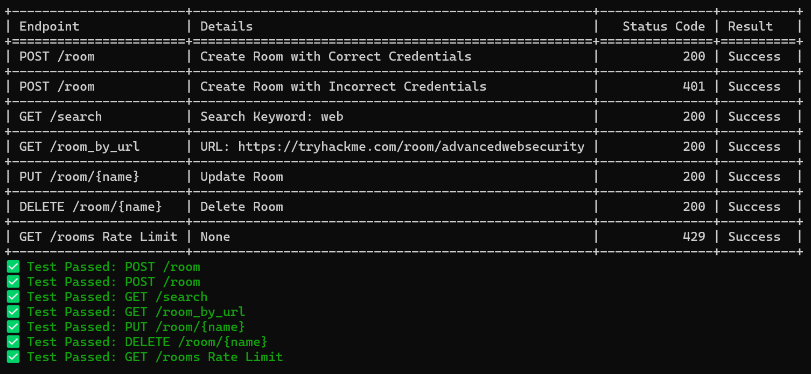

# 🔍 TryHackMe Solutions API

## 🌟 Overview

This project is a RESTful API built with FastAPI to manage a collection of rooms. Each room has attributes like name, description, URL, tags, tasks, write-ups, and videos. The API provides endpoints to create, update, delete, search, and retrieve rooms.  Additionally, users can submit solutions to get approved and featured in the API/Website. The project also includes tests to ensure the API functions correctly using the `requests` library. 

## 📂 Folder Structure

```
project/
│
├── src/
│   ├── __init__.py
│   ├── main.py          # Main FastAPI app
│   ├── models.py        # Pydantic models
│   └── database.py      # Database connection and utilities
│
├── tests/
│   ├── __init__.py
│   └── test_api.py      # Test cases
│
├── utils/
│   ├── __init__.py
│   ├── populate_db.py   # Script to populate the database
│   └── delete_rooms.py   # Script to delete all room entries
│
├── .env                 # Environment variables
├── Makefile             # Makefile for quick github commands
└── requirements.txt     # Dependencies
```

## 🚀 Technologies Used

- **FastAPI**: For building the web API.
- **Pydantic**: For data validation using Python type annotations.
- **MongoDB**: For the database, with `pymongo` as the driver.
- **SlowAPI**: For rate limiting.
- **Python**: The programming language used.
- **Requests**: For making HTTP requests in the test suite.

## 🛠️ Installation

1. **Clone the repository**:

   ```bash
   git clone https://github.com/your-username/your-repo.git
   cd your-repo
   ```

2. **Create a virtual environment** (optional but recommended):

   ```bash
   python -m venv venv
   source venv/bin/activate  # On Windows, use `venv\Scripts\activate`
   ```

3. **Install dependencies**:

   ```bash
   pip install -r requirements.txt
   ```

4. **Setup environment variables**:

   Create a `.env` file in the root of the project with the following content:

   ```env
   MONGODB_URL=mongodb://localhost:27017
   ADMIN_USERNAME=your_username
   ADMIN_PASSWORD=your_password
   ```
  
   Refer `.env.template` provided

## 🚀 Running the Application

### Using Uvicorn

1. **Start the FastAPI server**:

   ```bash
   uvicorn src.main:app --reload
   ```

   The API will be available at `http://127.0.0.1:8000`.

## 📜 API Endpoints

- **GET /rooms**: List all rooms.
- **GET /room/{name}**: Get details of a specific room.
- **GET /search**: Search rooms by keyword.
- **GET /room_by_url**: Get room details by URL.
- **POST /room**: Create a new room (requires authentication).
- **PUT /room/{name}**: Update an existing room (requires authentication).
- **DELETE /room/{name}**: Delete a room (requires authentication).
- **POST /submit**: Submit a solution to get featured.

### 🔒 Security Features

- **Authentication**: The API uses Basic Authentication. Sensitive endpoints require valid credentials.
- **Rate Limiting**: Implemented using SlowAPI to prevent abuse and ensure fair usage.
- **IP Logging and Ban**: Tracks failed login attempts and bans IPs exceeding the threshold.

## 🧪 Testing the API

1. **Run tests with the `requests` library**:

   ```bash
   python tests/test_api.py
   ```

2. **Test Coverage**:

   The tests ensure endpoints function correctly, handle errors, and respect rate limits.


  

## 🚀 Example Requests

### List Rooms `GET /rooms`

**Example Response:**

```json
[
  {
    "name": "Basic Pentesting",
    "description": "A beginner-friendly room to learn basic pentesting skills.",
    "room_url": "https://tryhackme.com/room/basicpentesting",
    "tags": ["beginner", "pentesting"],
    "tasks": [
      {
        "title": "Task 1",
        "description": "Find the hidden flag.",
        "questions": [
          {"number": 1, "question": "Where is the flag located?", "solution": "In the hidden directory."},
          {"number": 2, "question": "What is the flag?", "solution": "THM{hidden_flag}"}
        ]
      }
    ],
    "writeups": [
      {"title": "Basic Pentesting Writeup", "url": "https://example.com/writeup1"}
    ],
    "videos": [
      {"title": "Basic Pentesting Video", "url": "https://example.com/video1"}
    ]
  }
]
```

## 🔧 Utility Scripts

### Populating the Database

Run the script to add test data to the database:

```bash
python utils/populate_db.py
```

### Deleting All Room Entries

Run the script to remove all room entries:

```bash
python utils/delete_db.py
```

## 🛠️ Development Commands

The `Makefile` provides some handy shortcuts:

- **Run server**: `make run`
- **Run tests**: `make test`
- **GitHub push**: `make push`
- **GitHub pull**: `make pull`

## 📜 License

This project is licensed under the MIT License. See the [LICENSE](LICENSE.md) file for details.
